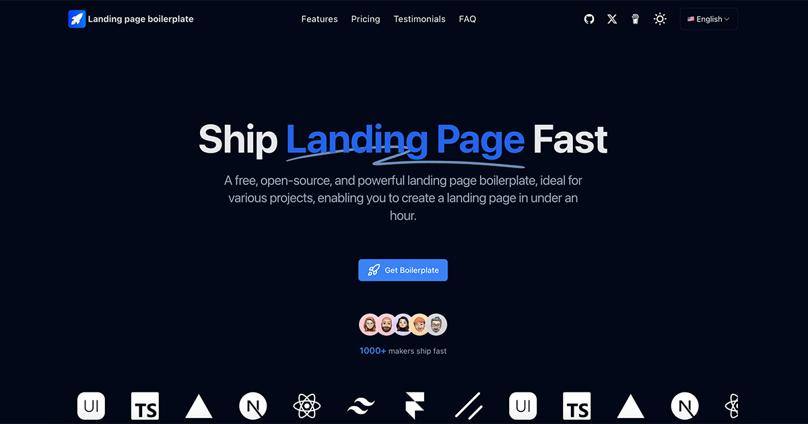

🌍 _[English](README.md) ∙ [简体中文](README-zh.md)_

🚀 Looking for a full-featured SaaS Starter Kit? [Check out the Next.js SaaS Template](https://nexty.dev)

# Landing Page for Bona Nit

An open-source, free, and beautifully designed landing page template. By simply replacing or adjusting the icons and text, you can publish your own product landing page.

Demo address：https://landing-page-bonanit.vercel.app/

[](https://landing-page-bonanit.vercel.app/)

## Tech Stack

Landing page boilerplate is built on the following stack:

- Next.js – Frontend/Backend
- TailwindCSS – Styles
- Google Analytics
- Vercel - Hosting

## Running Locally

After cloning the repo, you need to copy the `.env.example` file to create a `.env` file and fill in the required fields.

Then, run the application in the command line and it will be available at `http://localhost:3000`.

```bash
npm run dev
```

## Build Your Project

Edit these files:

- `.env` or `.env.local`
- `config/site.ts`, fill in your website information.
- `public`, change logo file
- `public/robots.txt`
- `app/sitemap.ts`

## One-Click Deploy

Deploy the example using Vercel:

[](https://vercel.com/new/clone?repository-url=https://github.com/Kano85/Landingpage-bonanit&project-name=landing-page-bonanit&repository-name=landing-page-bonanit&demo-title=LandingPageBonanit&demo-description=Landing%20page%20for%20Bona%20Nit.&demo-url=https://landing-page-bonanit.vercel.app/&demo-image=https://landing-page-bonanit.vercel.app/og.png)

## Generate a Docker image and deploy it to the server

Generate a Docker image and deploy it to the server

```bash
npm run docker
```

A Docker image named landing-page-boilerplate.tar will be generated in the root directory, and then the image will be deployed to the server using Docker commands.

## About the Author

This project was adapted by Harold Cano. You can find more of his work here:

[Github](https://github.com/Kano85)

